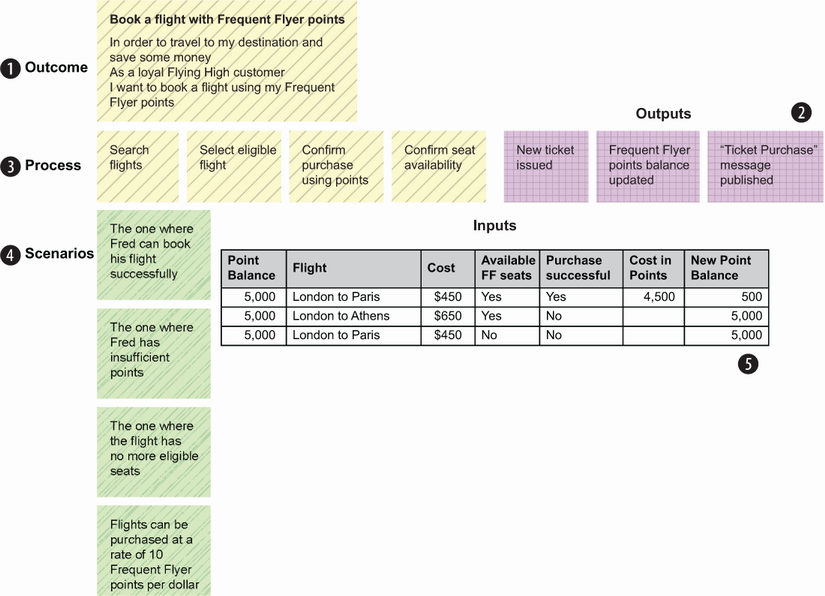

# job-hunting-server-service-jh

## Framework

1. Web framework
    1. axum
2. Database
    1. PostgreSQL
        > <https://www.postgresql.org/docs/17/index.html>

        1. DataType <https://www.postgresql.org/docs/17/datatype.html>
        2. Docker Images <https://hub.docker.com/r/bitnami/postgresql>
            1. username = postgres
            2. password = changeme
3. Database access Framework
    1. SeaOrm
        > <https://github.com/SeaQL/sea-orm>
        > <https://www.sea-ql.org/sea-orm-cookbook/>

        ```shell
            sea-orm-cli migrate up
            sea-orm-cli generate entity -o src/data/entity
        ```

4. Test
    1. REST API
    2. Database
        1. Testcontainers pg
    3. Logic
    4. BDD
        1. <https://cucumber.io/>
        2. <https://github.com/cucumber-rs/cucumber>
            > <https://cucumber-rs.github.io/cucumber/main/quickstart.html>
            1. <https://cucumber-rs.github.io/cucumber/main/writing/languages.html>

5. Log
    1. 

### App

1. Database upgrade
2. Database Schema
    1. job(? with repo user?)
    2. company(? with repo user?)
    3. tag
    4. job tag
    5. company tag
    6. all job(with repo user,ranking user contribute)
    7. all company(with repo user,ranking user contribute)
3. Data sync
    1. github account
    2. github repo
    3. sync logic
        1. calculate task
        2. download file
        3. merge file
4. Search
    1. job search
    2. company search
    3. job crud
    4. company crud
    5. tag crud
    6. job tag crud
    7. company tag crud
5. Statistic
    1. job
    2. company
    3. job tag
    4. company tag

## Workflow

### 背景：为了构建正确的软件，项目采用TDD进行项目推进的指导思想

> 参考资料：BDD in Action, Second Edition (John Ferguson Smart & Jan Molak [Smart, John Ferguson & Molak, Jan])


### 关键活动

1. Speculate—Where the team has conversations with businesspeople to identify and understand high-level business goals and identify the key features that will help us deliver these goals.

    推测——团队与业务人员进行对话，以确定和理解高级业务目标，并确定有助于我们实现这些目标的关键功能。

2. Illustrate—Where team members build a deeper understanding of a specific feature, through conversations about concrete examples of business rules and user journeys.

    说明——团队成员通过讨论业务规则和用户旅程的具体示例，对特定功能有更深入的了解。

3. Formulate—Where team members transform key examples into executable specifications, using a notation that is both readable for businesspeople and that can be executed as automated tests.

    制定——团队成员使用业务人员可读且可作为自动化测试执行的符号将关键示例转换为可执行规范。

4. Automate—Where developers and testers turn these executable specifications into automated acceptance tests and use these automated acceptance tests to drive the development process.

    自动化——开发人员和测试人员将这些可执行规范转化为自动化验收测试，并使用这些自动化验收测试来驱动开发过程。

5. Demonstrate—Where the passing automated acceptance tests act as evidence that a feature has been correctly implemented and as documentation illustrating the current features and how they work. This is where the team verifies that a feature does what was asked of it.

    演示——通过自动验收测试作为功能已正确实现的证据，并作为说明当前功能及其工作方式的文档。团队在这里验证某个功能是否符合要求。

6. Validate—Where the team and the business see how the features fare in the real world and whether they deliver the business value they promised.

    验证——团队和企业可以了解这些功能在现实世界中的表现以及它们是否实现了他们承诺的业务价值。

### 具体步骤

1. Speculate（推测阶段）
    1. The vision statement（愿景声明）
        1. 使用的工具: 愿景声明的模板

            ```text
                FOR <target customer>                                  ❶
                WHO <needs something>                                  ❷
                THE <product name> is a <product category>             ❸
                THAT <key benefit, compelling reason to buy>           ❹
                UNLIKE <primary competitive alternative>               ❺
                OUR PRODUCT <statement of primary differentiation>     ❻
            ```

    2. Identifying business objectives（确定业务目标）
        > *商业目标*: **SMART**:Specific(具体的),Measurable(可测量的),Achievable(可实现的),Relevant(相关的),Time-bound(有时间限制)；**分类**：Increasing revenue(增加收入),Reducing costs(降低成本),Protecting revenue(保护收入),Avoiding future costs(避免未来成本)

        > *非营利组织项目的业务目标*: **分类**：Improving service(改善服务),Reducing costs(降低成本),Avoiding future costs(避免未来成本)
        1. 使用的工具: 简短大纲

            ``` text
                In order to plan my trips more effectively                     ❶
                As a commuter                                                  ❷
                I want to know the optimal itinerary between two stations      ❸
            ```

            ```text
                As a <stakeholder>                             ❶
                I want <something>                             ❷
                So that <I can achieve some business goal>     ❸
            ```

    3. Discovering capabilities and features（发现功能和特性）
        1. 使用的工具(简单的): Impact Map
            > <http://impactmapping.org>

            

        2. 使用的工具（综合的）: Pirate Metrics And Pirate Canvases

            
            
    4. Describing features（描述特征）
        1. 使用的工具: feature format

            ``` text
                Feature: Online membership renewal                  ❶
                In order to renew my membership more easily         ❷
                As a Frequent Flyer member                          ❸
                I want to be able to renew my membership online     ❹
            ```

        2. 四个术语: capabilities(功能), features(特性), User Stories(用户故事), examples(示例)

            
            

        3. 使用的工具: story format

        ```text
            Story: Providing a secure password when registering                  ❶
            In order to avoid hackers compromising member accounts               ❷
            As the systems administrator                                         ❸
            I want new members to provide a secure password when they register   ❹
        ```

2. Illustrate（说明阶段）
    1. Discovering the feature(发现特性)
        1. 三个朋友
        2. 使用的工具: Example Mapping(示例映射)

            
        3. 使用的工具: Feature Mapping(特性映射)

            
        4. OOPSI 模型

            
    2. Slicing the feature into User Stories（将特性切分为用户故事）

3. Formulate（制定阶段）
    1. From examples to executable specifications（从示例到可执行规范）
        1. 使用的工具:

            ```text
            Feature: Earning Frequent Flyer points from flights
 
                Scenario: Flights within Europe earn 100 points
                    Given Tara is a Frequent Flyer traveler
                    When she completes a flight between Paris and Berlin
                    Then she should earn 100 points
            ```

4. Automate（自动化阶段）
    1. From executable specifications to automated tests（从可执行规范到自动化测试）
        1. 使用的工具: Cucumber
        2. 测试层级: Low-level,Service-level,UI

        

5. Demonstrate（演示）
    1. Tests as living documentation（测试作为活文档）
        1. 使用的工具: Cucumber的测试报告

        

### 实践

1. 业务目标 (business objectives)

2. 功能 (capability)

3. 特性 (feature)

4. 用户故事(user story)

5. 示例(example)

6. 可执行规范(executable specifications)

7. 自动化可执行规范(automating the executable specifications)

## Cicd

## Docs

## THANKS
